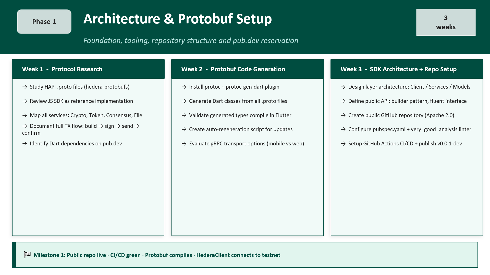

# Phase 1 - Architecture & Protobuf Setup
 
**Duration:** 3 weeks &nbsp;|&nbsp; **Status:** ⏳ Pending &nbsp;|&nbsp; **Phase:** 1 of 6
 
← [Back to ROADMAP](../../ROADMAP.md)
 
---
 
## Overview
 
Phase 1 establishes the complete foundation of the SDK. No functional features are built yet, this phase is about making the right architectural decisions, generating the Dart code from Hedera's Protobuf definitions, and setting up the repository infrastructure that all future phases will depend on.
 
> **Key principle:** Decisions made in Phase 1 are the hardest to change later. The architecture, the public API conventions, and the CI/CD pipeline must be solid before any feature work begins.

<br>  



 
## Week 1 - Protocol Research
 
**Goal:** Deeply understand the Hedera API (HAPI) before writing a single line of SDK code.
 
### Tasks
 
- [x] Study all HAPI `.proto` files - [github.com/hashgraph/hedera-protobufs](https://github.com/hashgraph/hedera-protobufs)
- [x] Map all services: `CryptoService`, `TokenService`, `ConsensusService`, `FileService`, `SmartContractService`, `NetworkService`
- [x] Review the Hedera JavaScript SDK as the primary reference implementation
- [x] Document the complete transaction lifecycle: construction → signing → serialization → gRPC submission → receipt polling
- [x] Identify all available Dart packages on pub.dev for each technical component
- [x] Analyze the Java SDK for design patterns to replicate in Dart
### Key questions to answer
 
- Which `.proto` files are required for Phase 1 scope?
- What gRPC transport strategy works best for Flutter mobile (iOS + Android)?
- How does the JavaScript SDK handle node selection and fee calculation?
- What are the differences between mainnet, testnet, and previewnet configurations?
### Output
 
A research document (can be a GitHub Discussion or internal doc) summarizing findings and decisions before proceeding to Week 2.
 
## Week 2 - Protobuf Code Generation
 
**Goal:** Generate valid, compilable Dart classes from all Hedera Protobuf definitions.
 
### Tasks
 
- [x] Install `protoc` (Protocol Buffer compiler)
- [x] Install `protoc-gen-dart` plugin - [pub.dev/packages/protoc_plugin](https://pub.dev/packages/protoc_plugin)
- [x] Clone [hedera-protobufs](https://github.com/hashgraph/hedera-protobufs) and identify all relevant `.proto` files
- [x] Generate Dart classes from all HAPI service definitions
- [x] Validate that all generated types compile correctly in a Flutter project
- [x] Create `scripts/generate_proto.ps1` - automation script for future regeneration
- [x] Commit generated Protobuf code to `lib/src/proto/` (versioned artifact)
- [x] Evaluate gRPC transport options:
  - `package:grpc` - uses `dart:io`, works on mobile, **not** on Flutter Web
  - Decision: **Stage 1 = iOS + Android only**, Flutter Web deferred to Stage 2
### Key `.proto` files
 
```
services/
  basic_types.proto           ← AccountId, TokenId, TransactionId
  crypto_service.proto        ← accounts and HBAR
  token_service.proto         ← HTS (fungible + NFTs)
  consensus_service.proto     ← HCS topics
  file_service.proto          ← HFS (file storage)
  transaction_contents.proto  ← TX body structure
  response.proto              ← query responses
mirror/
  consensus_service.proto     ← Mirror Node streaming
```
 
### Output
 
All Protobuf-generated Dart files in `lib/src/proto/` - compiling without errors.
 
## Week 3 - SDK Architecture + Repository Setup
 
**Goal:** Define the complete public API design, set up the repository infrastructure, and publish a dev version to pub.dev.
 
### Tasks
 
**Architecture**
- [x] Design SDK layer structure: Client → Services → Models → Crypto
- [ ] Define public API conventions:
  - Builder / fluent pattern for transactions
  - `async`/`await` throughout - no callbacks
  - Strong typing for all IDs (`AccountId`, `TokenId` - not raw `String`)
  - Immutable models where possible
  - Typed exceptions: `HederaStatusException` with all `Status` codes
- [x] Create Architecture Decision Records (ADR) documenting key choices
- [x] Define folder structure (see below)
**Repository**
- [x] Create public GitHub repository with Apache 2.0 `LICENSE`
- [x] Configure `pubspec.yaml` with all dependencies and pub.dev metadata
- [x] Set up `very_good_analysis` linter - enforces pub.dev best practices from day one
- [x] Configure GitHub Actions CI/CD:
  - `dart analyze --fatal-infos`
  - `dart format --set-exit-if-changed .`
  - `flutter test --coverage`
  - Codecov upload (threshold: 85%) ← deferred to Phase 5
  - `dart pub publish --dry-run` ← deferred to Phase 5
- [x] Create `README.md`, `CONTRIBUTING.md`, `CODE_OF_CONDUCT.md`, `CHANGELOG.md`
- [x] Publish `v0.0.1-dev` to pub.dev (reserve package name)
### SDK folder structure
 
```
hedera_flutter_sdk/
  lib/
    src/
      client/       ← HederaClient, Network, Operator config
      crypto/       ← PrivateKey, PublicKey, Mnemonic (BIP-39)
      transactions/ ← TransactionBuilder base + all TX types
      queries/      ← QueryBuilder base + all Query types
      hts/          ← Hedera Token Service
      hcs/          ← Hedera Consensus Service
      mirror/       ← Mirror Node REST + WebSocket client
      models/       ← AccountId, TokenId, Hbar, TransactionId
      proto/        ← Generated Protobuf code (DO NOT EDIT manually)
    hedera_flutter_sdk.dart  ← Public barrel file (exports only)
  test/
    unit/           ← Pure unit tests (no network required)
    integration/    ← Tests against Hedera testnet
  example/          ← Demo Flutter app
  scripts/
    generate_proto.sh  ← Regenerate Protobuf Dart code
```
 
### Planned public API style
 
```dart
// Fluent builder pattern - inspired by the JavaScript SDK
final client = HederaClient.forTestnet()
    .setOperator(accountId, privateKey);
 
final receipt = await AccountCreateTransaction()
    .setKey(privateKey.publicKey)
    .setInitialBalance(Hbar(1))
    .setMaxAutomaticTokenAssociations(10)
    .execute(client);
```
 
### Output
 
Public repository live, CI/CD passing, `v0.0.1-dev` published on pub.dev with package name reserved.
 
## 🎯 Milestone 1 - Definition of Done
 
> Phase 1 is complete when:
> - The GitHub repository is public with all base files committed
> - CI/CD pipeline passes without errors (green badge)
> - Protobuf-generated Dart code compiles in Flutter without errors
> - A basic `HederaClient` instance can connect to Hedera testnet via gRPC
> - `v0.0.1-dev` is published and visible on pub.dev
 
## Dependencies
 
| Dependency | Version | Purpose |
|:-----------|:-------:|:--------|
| `grpc` | `^3.2.4` | gRPC transport to consensus nodes |
| `protobuf` | `^3.1.0` | Protobuf runtime (HAPI) |
| `http` | `^1.2.1` | Mirror Node REST client |
| `web_socket_channel` | `^2.4.0` | Real-time WebSocket subscriptions |
| `pointycastle` | `^3.9.1` | ED25519 / ECDSA cryptography |
| `bip39` | `^1.0.6` | BIP-39 mnemonics (EN + ES) |
| `convert` | `^3.1.1` | Hex encoding/decoding |
| `fixnum` | `^1.1.0` | Int64 support for Protobuf |
 
## References
 
- [Hedera Protobuf definitions](https://github.com/hashgraph/hedera-protobufs)
- [Hedera JavaScript SDK](https://github.com/hashgraph/hedera-sdk-js) ← reference implementation
- [Hiero SDK repositories](https://github.com/hiero-ledger)
- [protoc-gen-dart](https://pub.dev/packages/protoc_plugin)
- [very_good_analysis](https://pub.dev/packages/very_good_analysis)
---
 
*Next: [Phase 2 - Cryptography & Account Management](Phase_2_Crypto_Accounts.md)*
