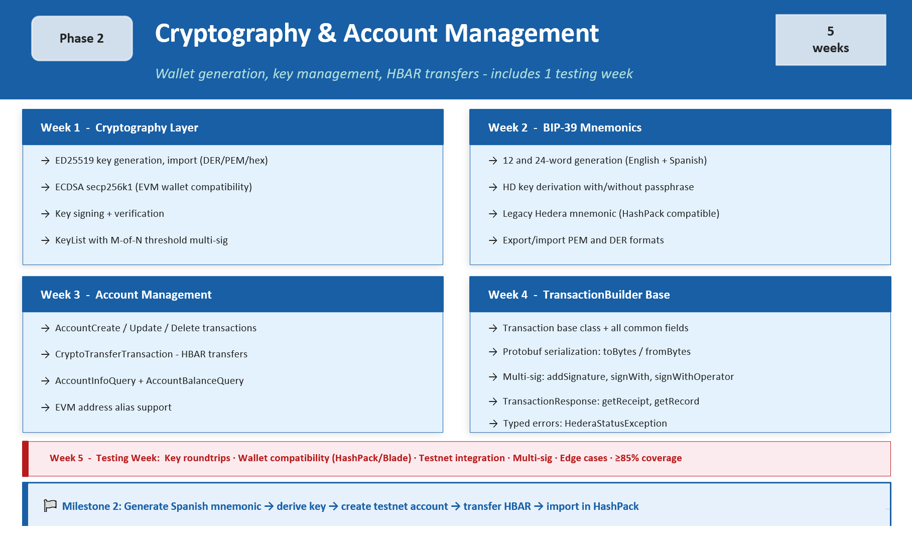

# Phase 2 - Cryptography & Account Management

**Duration:** 5 weeks (4 dev + 1 testing) &nbsp;|&nbsp; **Status:** ⏳ Pending &nbsp;|&nbsp; **Stage:** 2 of 6

← [Back to ROADMAP](../../ROADMAP.md)

---

## Overview

Phase 2 implements the cryptographic foundation and account management layer. By the end of this phase, a developer can generate a wallet with a Spanish or English mnemonic, create a Hedera account on testnet, query its balance, and send HBAR, all in under 20 lines of Dart.

> **Key principle:** The cryptography layer is the most security-critical part of the SDK. Private keys must never be logged, printed, or exposed in error messages under any circumstances. Security tests are mandatory, not optional.

<br>



## Week 1 - Cryptography Layer

**Goal:** Implement complete key generation, import, signing, and verification in pure Dart.

### Tasks

- [ ] `PrivateKey.generateED25519()` - generate new ED25519 key pair
- [ ] `PrivateKey.generateECDSA()` - generate ECDSA secp256k1 key pair
- [ ] `PrivateKey.fromString(hex)` - import from DER hex string
- [ ] `PrivateKey.fromBytes(bytes)` - import from raw bytes
- [ ] `PrivateKey.fromPem(pem)` - import from PEM format
- [ ] `PublicKey` - derivation from `PrivateKey`, `fromString()`, `fromBytes()`
- [ ] `PublicKey.toEvmAddress()` - EVM-compatible address derivation
- [ ] Transaction signing: `privateKey.sign(bytes)` → `Uint8List`
- [ ] Signature verification: `publicKey.verify(message, signature)`
- [ ] `KeyList` - multi-key with M-of-N threshold configuration

### Code example

```dart
// Generate new ED25519 key pair
final privateKey = PrivateKey.generateED25519();
final publicKey  = privateKey.publicKey;

print(privateKey.toString()); // 302e020100300506032b6570...
print(publicKey.toString());  // 302a300506032b6570...

// Import from existing hex string
final imported = PrivateKey.fromString("302e020100300506032b6570...");

// Multi-signature: require 2 of 3 keys
final keyList = KeyList(
  keys: [key1, key2, key3],
  threshold: 2,
);
```

### Security requirements

- Private keys must **never** appear in `toString()`, logs, or error messages
- All key material must be zeroed from memory after use where possible
- Unit tests must verify keys are not exposed in exception stack traces

## Week 2 - BIP-39 Mnemonics

**Goal:** Implement mnemonic generation and HD key derivation with **English** and **Spanish** support.

### Tasks

- [ ] `Mnemonic.generate24()` - generate 24-word mnemonic
- [ ] `Mnemonic.generate12()` - generate 12-word mnemonic
- [ ] `Language` enum - `Language.english`, `Language.spanish`
- [ ] `Mnemonic.fromWords(List<String> words)` - recover from existing words
- [ ] `mnemonic.toPrivateKey({String passphrase = ''})` - BIP-39 derivation
- [ ] `mnemonic.toLegacyPrivateKey()` - Hedera legacy derivation (HashPack / Blade compatible)
- [ ] Wordlist validation - detect invalid words before derivation

### Code example

```dart
// Generate wallet with Spanish mnemonic - for LATAM users
final mnemonic = await Mnemonic.generate24(language: Language.spanish);
print(mnemonic.words); // ['arbol', 'casa', 'luna', 'perro', ...]

// Derive private key (with optional passphrase)
final privateKey = await mnemonic.toPrivateKey(passphrase: 'optional');

// Recover from existing words
final recovered = await Mnemonic.fromWords([
  'arbol', 'casa', 'luna', 'perro', ...24 words
]);
final restoredKey = await recovered.toPrivateKey();
```

### Compatibility requirement

Keys derived from mnemonics must be importable in **HashPack** and **Blade Wallet** without errors. This is verified in the Week 5 testing week.

## Week 3 - Account Management

**Goal:** Implement full account lifecycle and HBAR transfers on testnet.

### Tasks

- [ ] `AccountCreateTransaction` - key, initial balance, memo, `maxAutomaticTokenAssociations`
- [ ] `AccountUpdateTransaction` - update key, memo, auto-renewal period
- [ ] `AccountDeleteTransaction` - delete and transfer remaining balance to transfer account
- [ ] `CryptoTransferTransaction` - transfer HBAR between multiple accounts in one TX
- [ ] `AccountInfoQuery` - full account info via consensus node
- [ ] `AccountBalanceQuery` - HBAR balance + token balances
- [ ] EVM address alias - create account using EVM-compatible address as alias

### Code example

```dart
// Create new account with auto-token-association
final receipt = await AccountCreateTransaction()
    .setKey(newPrivateKey.publicKey)
    .setInitialBalance(Hbar(1))
    .setAccountMemo("NemorixPay user")
    .setMaxAutomaticTokenAssociations(10)
    .execute(client);

final newAccountId = receipt.accountId!;
print('Account created: $newAccountId'); // 0.0.XXXXXXX

// Transfer HBAR
await TransferTransaction()
    .addHbarTransfer(senderAccountId, Hbar(-1))
    .addHbarTransfer(receiverAccountId, Hbar(1))
    .execute(client);
```

> `setMaxAutomaticTokenAssociations(10)` is critical for NemorixPay UX, allows a new user to receive USDC without a prior `TokenAssociate` transaction.

## Week 4 - TransactionBuilder Base

**Goal:** Implement the base transaction infrastructure that all future phases will reuse.

### Tasks

- [ ] `Transaction` base class with all common fields:
  - `nodeAccountId`, `transactionFee`, `memo`, `validDuration`, `transactionId`
- [ ] Protobuf serialization: `toBytes()` / `Transaction.fromBytes(bytes)`
- [ ] Multi-signature support:
  - `transaction.sign(privateKey)` - add signature
  - `transaction.signWith(privateKeyList)` - sign with multiple keys
  - `transaction.signWithOperator(client)` - sign with operator key
- [ ] `TransactionResponse` - returned after `execute(client)`
  - `response.getReceipt(client)` - poll until receipt available
  - `response.getRecord(client)` - full record with fees paid
- [ ] `TransactionReceiptQuery` - check TX status by `TransactionId`
- [ ] `TransactionRecordQuery` - full TX record with fees and transfers
- [ ] Typed error handling:

```dart
try {
  final receipt = await transaction.execute(client);
} on HederaStatusException catch (e) {
  switch (e.status) {
    case Status.insufficientAccountBalance:
      // handle insufficient balance
    case Status.tokenNotAssociatedToAccount:
      // handle token not associated
    case Status.accountFrozenForToken:
      // handle frozen account
    default:
      rethrow;
  }
}
```

## Week 5 - Testing Week 🧪

**Goal:** Validate all Phase 2 functionality with comprehensive unit and integration tests against Hedera testnet.

### Unit tests

- [ ] Key generation: ED25519 and ECDSA - generate, sign, verify, serialize
- [ ] Key roundtrip: `toString()` → `fromString()` produces identical key
- [ ] BIP-39: generate → derive → recover with 100% fidelity
- [ ] Spanish wordlist: all 2048 words load correctly
- [ ] `KeyList`: M-of-N threshold enforcement
- [ ] TX serialization: `toBytes()` → `fromBytes()` produces identical transaction
- [ ] Security: private keys never appear in `toString()`, logs, or exceptions

### Integration tests (testnet)

- [ ] Create account → query info → verify fields match
- [ ] Transfer HBAR → verify receipt status `SUCCESS`
- [ ] Multi-sig TX: 2-of-3 keys required, verify enforcement
- [ ] Edge cases:
  - Insufficient HBAR balance → `Status.insufficientAccountBalance`
  - Invalid account ID → appropriate exception
  - Expired transaction → `Status.transactionExpired`
  - Wrong key signing → `Status.invalidSignature`

### Compatibility tests

- [ ] Mnemonic-derived key importable in **HashPack** without errors
- [ ] Mnemonic-derived key importable in **Blade Wallet** without errors
- [ ] Known test vector: derive key from known mnemonic → verify matches expected public key hex

### Coverage target

| Module | Lines | Branches |
|:-------|:-----:|:--------:|
| `crypto/` | ≥ 90% | ≥ 85% |
| `accounts/` | ≥ 85% | ≥ 85% |
| Overall Phase 2 | ≥ 85% | ≥ 85% |

## 🎯 Milestone 2 - Definition of Done

> Phase 2 is complete when:
> - A developer can generate a 24-word Spanish or English mnemonic, derive a key, create a testnet account, query its balance, and send HBAR - **in under 20 lines of Dart**
> - The resulting wallet is importable in HashPack without errors
> - All unit and integration tests pass with ≥ 85% coverage

## References

- [pointycastle](https://pub.dev/packages/pointycastle) - ED25519 / ECDSA
- [bip39](https://pub.dev/packages/bip39) - mnemonic generation
- [Hedera JS SDK - crypto](https://github.com/hashgraph/hedera-sdk-js/tree/main/src/cryptography)
- [HashPack Wallet](https://www.hashpack.app) - compatibility target
- [Blade Wallet](https://bladewallet.io) - compatibility target

---

*Previous: [Phase 1 - Architecture](Phase_1_Architecture.md) &nbsp;|&nbsp; Next: [Phase 3 - HTS Tokens](Phase_3_HTS_Tokens.md)*
