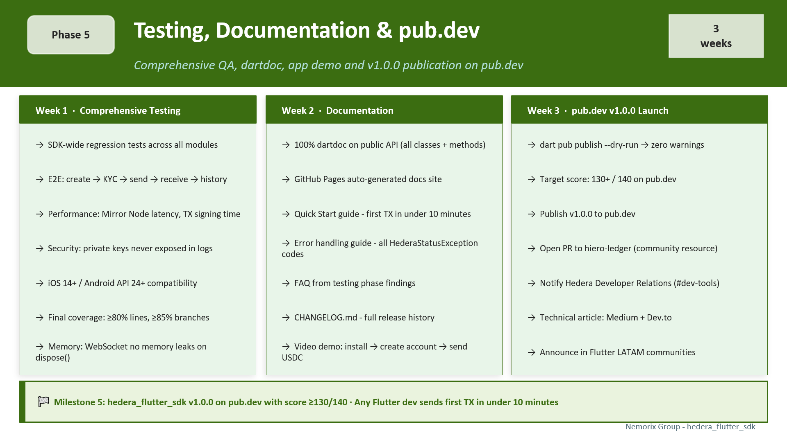

# Phase 5 - Testing, Documentation & pub.dev

**Duration:** 3 weeks &nbsp;|&nbsp; **Status:** ⏳ Pending &nbsp;|&nbsp; **Stage:** 5 of 6

← [Back to ROADMAP](../../ROADMAP.md) 

---

## Overview

Phase 5 transforms a working SDK into a production-quality, publicly available package. The three pillars of this phase are: comprehensive SDK-wide testing, professional API documentation with dartdoc, and official publication on pub.dev with a score of 130+/140.

> **Key principle:** A pub.dev score of 130+/140 is not a vanity metric, it directly affects how discoverable the package is in search results. Developers searching for "hedera dart" or "hedera flutter" will find this package based on its score and topic tags.

<br>




## Week 1 - Comprehensive Testing

**Goal:** Validate the entire SDK end-to-end, close any coverage gaps, and confirm production-readiness.

### Regression tests

- [ ] Run full test suite across all modules - verify no regressions from cross-module integration
- [ ] Re-run all Phase 2, 3, and 4 integration tests on testnet after combined integration

### End-to-end tests

- [ ] Complete NemorixPay flow on testnet:
  1. Generate Spanish mnemonic → derive key
  2. Create account with `maxAutomaticTokenAssociations(10)`
  3. Grant KYC for USDC token
  4. Send 50 USDC from sender to receiver (atomic transfer)
  5. Receive real-time notification via WebSocket
  6. Load transaction history from Mirror Node
  7. Verify HCS audit log recorded the remittance

### Specialized tests

- [ ] **Performance:** Mirror Node query latency (target: < 2 seconds), transaction signing time (target: < 100ms)
- [ ] **Security:** Private keys never appear in logs, `toString()`, error messages, or stack traces
- [ ] **Platform compatibility:** iOS 14+, Android API 24+, tested on both simulators and real devices
- [ ] **Flutter SDK versions:** Verify compatibility with Flutter stable and beta channels
- [ ] **Memory:** All WebSocket subscriptions release resources cleanly on `dispose()`

### Final coverage

| Module | Lines | Branches |
|:-------|:-----:|:--------:|
| `crypto/` | ≥ 90% | ≥ 85% |
| `accounts/` | ≥ 85% | ≥ 85% |
| `hts/` | ≥ 85% | ≥ 85% |
| `mirror/` | ≥ 85% | ≥ 85% |
| `hcs/` | ≥ 85% | ≥ 85% |
| **SDK total** | **≥ 80%** | **≥ 85%** |


## Week 2 - API Documentation

**Goal:** Document 100% of the public API with dartdoc, publish to GitHub Pages, and write developer guides.

### dartdoc requirements

Every public class, method, getter, and typedef must have:
- A clear description of what it does
- Parameter documentation (all `@param` or named parameters)
- Return value description
- Possible exceptions it can throw
- At least one code example in a `/// ```dart` block

```dart
/// Creates a new account on the Hedera network.
///
/// The account requires an initial HBAR balance to cover the creation fee.
/// The minimum recommended balance is [Hbar(1)].
///
/// Use [setMaxAutomaticTokenAssociations] to allow the account to receive
/// tokens without a prior [TokenAssociateTransaction] - important for
/// smooth user onboarding in apps like NemorixPay.
///
/// Example:
/// ```dart
/// final receipt = await AccountCreateTransaction()
///     .setKey(privateKey.publicKey)
///     .setInitialBalance(Hbar(1))
///     .setMaxAutomaticTokenAssociations(10)
///     .execute(client);
///
/// final accountId = receipt.accountId!;
/// print('Account created: $accountId'); // 0.0.XXXXXXX
/// ```
///
/// Throws [HederaStatusException] with [Status.insufficientPayerBalance]
/// if the operator does not have enough HBAR to cover fees.
class AccountCreateTransaction extends Transaction { ... }
```

### Tasks

- [ ] dartdoc 100% coverage on all public symbols
- [ ] Generate documentation site: `dart doc .`
- [ ] Publish docs to GitHub Pages (auto-deploy on each release via GitHub Actions)
- [ ] Write **Quick Start guide** - from zero to first transaction in under 10 minutes
- [ ] Write **Error handling guide** - all `HederaStatusException` status codes with explanations and solutions
- [ ] Write **FAQ** - common questions and issues found during testing phases
- [ ] Update `CHANGELOG.md` with all changes since `v0.0.1-dev`

### Open source files

- [ ] `README.md` - complete with all badges, examples, architecture, and links
- [ ] `CONTRIBUTING.md` - development setup, coding standards, PR process
- [ ] `CODE_OF_CONDUCT.md` - Contributor Covenant 2.1
- [ ] `example/` - complete demo Flutter app (NemorixPay v0.2 functionality)


## Week 3 - pub.dev Publication

**Goal:** Publish `v1.0.0` on pub.dev with a score of 130+/140.

### pub.dev score breakdown

| Criterion | Max | Target | Strategy |
|:----------|:---:|:------:|:---------|
| Follow Dart file conventions | 10 | 10/10 | `very_good_analysis` enforces from day one |
| Provide documentation | 20 | 20/20 | 100% dartdoc on public API |
| Support multiple platforms | 20 | 20/20 | Pure Dart - all platforms |
| Pass static analysis | 50 | 50/50 | Zero warnings in CI `--fatal-infos` |
| Up-to-date dependencies | 20 | 20/20 | Latest stable at launch |
| Support null safety | 20 | 20/20 | Dart 3.x throughout |
| **Total** | **140** | **130+** | |

### Publication checklist

- [ ] `dart pub publish --dry-run` - zero errors, zero warnings
- [ ] Verify `pubspec.yaml` fields: `name`, `description`, `version`, `repository`, `homepage`, `topics`
- [ ] Verify pub.dev renders documentation correctly (preview at `pub.dev/packages/...`)
- [ ] Tag git release: `v1.0.0`
- [ ] Create GitHub Release with detailed release notes
- [ ] Publish `v1.0.0` to pub.dev
- [ ] Open PR to [hiero-ledger](https://github.com/hiero-ledger) to register as community SDK resource
- [ ] Notify Hedera Developer Relations on Discord `#dev-tools`

### pubspec.yaml - key fields for pub.dev score

```yaml
name: hedera_flutter_sdk
description: >
  The first native Flutter/Dart SDK for the Hedera network.
  Supports account management, HBAR, HTS tokens, NFTs, HCS,
  and Mirror Node. Pure Dart - no platform channels.
version: 1.0.0
repository: https://github.com/nemorixgroup/hedera_flutter_sdk
homepage: https://nemorixpay.com
topics:
  - hedera
  - blockchain
  - hbar
  - hts
  - web3
  - dart
  - flutter
  - payments
```


## 🎯 Milestone 5 - Definition of Done

> Phase 5 is complete when:
> - `hedera_flutter_sdk` is available on pub.dev at `v1.0.0` with score **≥ 130/140**
> - 100% of the public API is documented with dartdoc
> - GitHub Pages documentation site is live
> - Any Flutter developer can run `flutter pub add hedera_flutter_sdk` and send their first transaction in under 10 minutes following the Quick Start guide


## References

- [Dart documentation guide](https://dart.dev/effective-dart/documentation)
- [pub.dev scoring criteria](https://pub.dev/help/scoring)
- [very_good_analysis](https://pub.dev/packages/very_good_analysis)
- [dart doc - documentation generator](https://dart.dev/tools/dart-doc)
- [Soneso stellar_flutter_sdk](https://pub.dev/packages/stellar_flutter_sdk) ← quality benchmark

---

*Previous: [Phase 4](Phase_4_Mirror_Node_HCS.md) &nbsp;|&nbsp; Next: [Phase 6 - Launch + HIP](Phase_6_Launch_HIP.md)*
