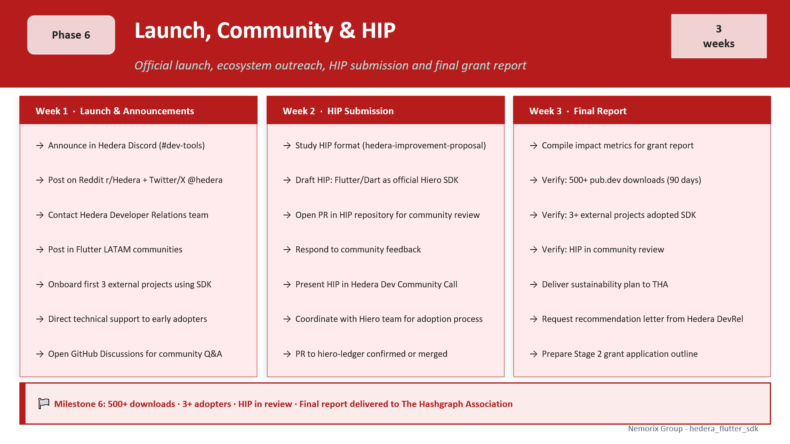

# Phase 6 - Launch, Community & HIP

**Duration:** 3 weeks &nbsp;|&nbsp; **Status:** ⏳ Pending &nbsp;|&nbsp; **Stage:** 6 of 6

← [Back to ROADMAP](../../ROADMAP.md)  

---

## Overview

Phase 6 takes the published SDK and makes it real in the Hedera ecosystem - through community outreach, a formal Hedera Improvement Proposal (HIP), external project adoption, and the final grant report delivered to The Hashgraph Association.

> **Key principle:** A published package with zero community awareness is a tree falling in an empty forest. Phase 6 exists to ensure that the Flutter community, the Hedera developer ecosystem, and the grant committee all know the SDK exists, works, and is being used.

<br>




## Week 1 - Launch & Community Outreach

**Goal:** Maximum visibility at launch - reach Flutter developers and the Hedera ecosystem simultaneously.

### Hedera ecosystem channels

- [ ] Post announcement in Hedera Discord - channels `#dev-tools` and `#announcements`
- [ ] Post on Hedera developer forum
- [ ] Contact **Hedera Developer Relations** team directly for official amplification
- [ ] Submit to [Hedera ecosystem directory](https://hedera.com/ecosystem)

### General developer channels

- [ ] Post on **Reddit** `r/Hedera` and `r/FlutterDev`
- [ ] Twitter/X thread mentioning `@hedera`, `@hiero_ledger`, `@FlutterDev`
- [ ] Post in **Flutter LATAM** communities (Telegram, Discord, Slack)
- [ ] Post on **pub.dev** blog / Dart newsletter if available

### GitHub community

- [ ] Open **GitHub Discussions** for Q&A - welcome first questions personally
- [ ] Create issue templates: `bug_report.md`, `feature_request.md`
- [ ] Pin a "Welcome + Quick Start" discussion post

### Announcement template

```
🚀 Introducing hedera_flutter_sdk v1.0.0

The first native Flutter/Dart SDK for the Hedera network
is now available on pub.dev!

✅ Account management + HBAR transfers
✅ Hedera Token Service (HTS) - fungible tokens + NFTs
✅ Native KYC, freeze, custom fees
✅ Mirror Node REST + real-time WebSocket
✅ Hedera Consensus Service (HCS)
✅ BIP-39 mnemonics in English and Spanish 🇺🇸🇪🇸
✅ Pure Dart - iOS, Android, macOS, Windows, Linux

📦 pub.dev: pub.dev/packages/hedera_flutter_sdk
💻 GitHub: github.com/nemorixgroup/hedera_flutter_sdk
📖 Docs: [GitHub Pages link]

Built by @NemorixGroup - powering NemorixPay,
a US-LATAM remittance platform built on Hedera.
```

### Early adopter onboarding

- [ ] Identify 5-10 Flutter projects in the Hedera ecosystem as potential early adopters
- [ ] Reach out directly - offer 1:1 integration support
- [ ] Target: **3+ confirmed external projects** using the SDK by end of Phase 6
- [ ] Document their use cases for the grant report


## Week 2 - HIP Submission

**Goal:** Submit a formal Hedera Improvement Proposal to establish the Flutter SDK as an officially recognized Hiero project.

### What is a HIP?

A Hedera Improvement Proposal (HIP) is the formal process for proposing changes, additions, or new resources to the Hedera/Hiero ecosystem - similar to EIPs in Ethereum or SEPs in Stellar. Submitting a HIP for the Flutter SDK signals that the project is serious about long-term ecosystem integration.

> Note: HIPs take weeks to months for community review. 

### Tasks

- [ ] Study the HIP format: [github.com/hashgraph/hedera-improvement-proposal](https://github.com/hashgraph/hedera-improvement-proposal)
- [ ] Review accepted HIPs as templates (especially SDK-related ones)
- [ ] Draft HIP document proposing Flutter/Dart as an officially supported SDK in Hiero
- [ ] Open Pull Request in the HIP repository
- [ ] Respond to community feedback during review period
- [ ] Coordinate with the Hiero team for the adoption process into the official SDK family

### HIP structure example

```markdown
---
hip: [number assigned by maintainers]
title: Add Flutter/Dart SDK as Official Hiero SDK
author: Miguel Fagundez <mfagundez@nemorixpay.com>
type: Informational
status: Draft
created: 2026-[month]-[day]
---

## Abstract
This HIP proposes the addition of an official Flutter/Dart SDK
to the Hiero project under the Linux Foundation Decentralized Trust.

## Motivation
Flutter has 3M+ developers worldwide with strong adoption in
Latin America, Southeast Asia, and emerging markets - exactly
the demographics Hedera targets for financial inclusion.
No native Dart/Flutter SDK exists on pub.dev today.

## Specification
- Pure Dart implementation (no platform channels)
- Supports: iOS, Android, macOS, Windows, Linux
- Services: Crypto, HTS, HCS, Mirror Node
- License: Apache 2.0
- Repository: github.com/nemorixgroup/hedera_flutter_sdk
- pub.dev: pub.dev/packages/hedera_flutter_sdk

## Reference Implementation
hedera_flutter_sdk v1.0.0 - production-tested via NemorixPay
(US-LATAM remittance platform).
```


## Week 3 - Final Report & Sustainability

**Goal:** Write a complete final report with verified impact metrics and a documented sustainability plan.

### Impact metrics to compile

| Metric | Target | Verification |
|:-------|:------:|:-------------|
| pub.dev downloads (90 days) | 500+ | pub.dev analytics screenshot |
| pub.dev score | 130+ / 140 | pub.dev package page screenshot |
| GitHub stars | 100+ | GitHub repository screenshot |
| External projects using SDK | 3+ | List with project names + contact |
| HIP submitted | ✅ | Link to HIP PR |
| PR to hiero-ledger | ✅ | Link to PR (merged or in review) |
| Technical article published | ✅ | Link to Medium / Dev.to article |
| Video demo published | ✅ | Link to video |

### Final report contents

- [ ] Executive summary of deliverables vs. commitments
- [ ] Milestone completion evidence:
  - M1: Repo URL + CI badge + testnet connection demo
  - M2: Coverage report + HashPack compatibility screenshot
  - M3: NemorixPay demo v0.1 video (USDC transfer on testnet)
  - M4: NemorixPay demo v0.2 video (WebSocket + history)
  - M5: pub.dev link + score + dartdoc site
  - M6: HIP PR + adopter list + impact metrics
- [ ] Budget reconciliation - actual spend vs. approved budget
- [ ] Sustainability plan:
  - NemorixPay production dependency guarantees long-term maintenance
  - Stage 2 roadmap: Flutter Web + HSCS (Smart Contracts)
  - Community contributors pipeline from GitHub Discussions
- [ ] Stage 2 outline - brief description of next steps

### Additional deliverables

- [ ] Update `CHANGELOG.md` with final v1.0.0 entry and all additions since launch


## 🎯 Milestone 6 - Definition of Done

> Phase 6 is complete when:
> - **500+** pub.dev downloads in the first 90 days
> - **3+** external projects confirmed using the SDK
> - HIP is **submitted** and in community review
> - Final report is **written** with all metrics verified
> - Sustainability plan is documented and presented

---

## Stage 2 Roadmap

After successful delivery of Stage 1, Nemorix Group intends to apply for a Stage 2 covering:

| Feature | Description |
|:--------|:------------|
| Flutter Web | HTTP/2 transport layer - gRPC without `dart:io` |
| HSCS | Hedera Smart Contract Service (Solidity / EVM) |
| HFS | Hedera File Service |
| JSON-RPC Relay | Full EVM / MetaMask compatibility |
| Extended mnemonics | French 🇫🇷 · Portuguese 🇧🇷 · Japanese 🇯🇵 · Korean 🇰🇷 |


## References

- [Hedera Discord](https://discord.gg/hedera)
- [HIP repository](https://github.com/hashgraph/hedera-improvement-proposal)
- [Hiero ledger](https://github.com/hiero-ledger)
- [The Hashgraph Association](https://hashgraph-group.com)
- [Hedera ecosystem directory](https://hedera.com/ecosystem)

---

*Previous: [Phase 5](Phase_5_Docs_pubdev.md)*
